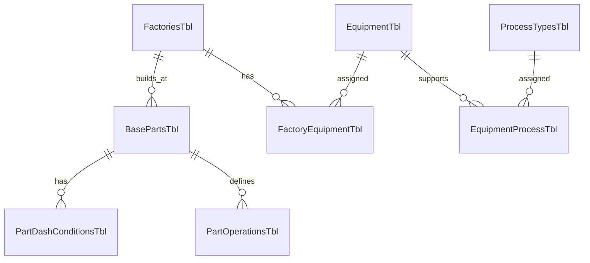

# Factory Capacity Database (VBA)

Paste-ready VBA for a new Excel workbook (`.xlsm`) that stores factory, equipment, process-type, and part-number master data in related tables for a future capacity model.

## Workbook sheets

### Capacity master data

| Sheet | Table | Purpose |
|---|---|---|
| Admin | — | Launch macros / buttons |
| Factories | `FactoriesTbl` | Factory master |
| Equipment | `EquipmentTbl` | Equipment master |
| ProcessTypes | `ProcessTypesTbl` | Process type master |
| FactoryEquipment | `FactoryEquipmentTbl` | Equipment at each factory |
| EquipmentProcesses | `EquipmentProcessTbl` | Process types per equipment |

### Part numbers (relational — no sheet per part)

| Sheet | Table | Purpose |
|---|---|---|
| **PartEditor** | `BasePartsTbl` | View all base parts; each part has one `FactoryCode` |
| PartDashConditions | `PartDashConditionsTbl` | Dash conditions per base part |
| PartOperations | `PartOperationsTbl` | Operations (`OperSeq`) per base part |

## VBA modules to add

### Standard modules

| File | Module name |
|---|---|
| `modConstants.bas` | modConstants |
| `modTableIO.bas` | modTableIO |
| `modValidation.bas` | modValidation |
| `modBootstrap.bas` | modBootstrap |
| `modExcelOptimize.bas` | modExcelOptimize |
| `modFormUI.bas` | modFormUI |
| `modFormLauncher.bas` | modFormLauncher |
| `modPartIO.bas` | modPartIO |

### Class module

| File | Class name |
|---|---|
| `clsFormControlHandler.cls` | clsFormControlHandler |

### UserForms

| UserForm name | Paste file | Purpose |
|---|---|---|
| `frmFactoryAdmin` | `frmFactoryAdmin.txt` | Factories |
| `frmEquipmentAdmin` | `frmEquipmentAdmin.txt` | Equipment |
| `frmProcessTypeAdmin` | `frmProcessTypeAdmin.txt` | Process types |
| `frmFactoryEquipmentAdmin` | `frmFactoryEquipmentAdmin.txt` | Factory-equipment links |
| `frmEquipmentProcessAdmin` | `frmEquipmentProcessAdmin.txt` | Equipment-process links |
| `frmPartEditor` | `frmPartEditor.txt` | **Main part editor** |
| `frmPartOperationsAdmin` | `frmPartOperationsAdmin.txt` | Operations per part |

Paste each `.txt` file into a blank UserForm with the matching `(Name)`.

### ThisWorkbook

Paste `ThisWorkbook.txt` into the ThisWorkbook code module.

## Setup steps

1. Save the workbook as **`FactoryCapacity.xlsm`**.
2. Import/paste all standard modules, `modPartIO`, and `clsFormControlHandler`.
3. Create seven blank UserForms and paste the matching form code.
4. Paste `ThisWorkbook.txt`.
5. Run **`BootstrapCapacityTables`** once.
6. Wire **Admin** and **PartEditor** buttons:

| Button caption | Macro |
|---|---|
| Manage Factories | `ShowFactoryAdmin` |
| Manage Equipment | `ShowEquipmentAdmin` |
| Manage Process Types | `ShowProcessTypeAdmin` |
| Assign Equipment to Factories | `ShowFactoryEquipmentAdmin` |
| Assign Processes to Equipment | `ShowEquipmentProcessAdmin` |
| Edit Parts | `ShowPartEditor` |
| Edit Selected Part (PartEditor sheet) | `EditSelectedPartFromSheet` |
| Part Operations | `ShowPartOperationsAdmin` |
| Rebuild Tables | `BootstrapCapacityTables` |

## Part number workflow

1. Add factories (`ShowFactoryAdmin`).
2. Open **`ShowPartEditor`** (or select a row on **PartEditor** and run **`EditSelectedPartFromSheet`**).
3. Create a base part, pick its factory, and add dash conditions in the same form.
4. Use **Operations** to maintain `OperSeq` rows in `PartOperationsTbl`.

## Notes

- **One sheet per part is not used.** All parts live in tables; **PartEditor** is the single view/edit hub.
- Each base part has exactly one factory via `FactoryCode` on `BasePartsTbl`.
- Assembly numbers for external queries: `BuildActiveAssemblyNumberList()` in `modPartIO` joins active base parts with active dash conditions.
- First data row is **row 4** (headers on row 3).
- `Active` flags accept `True`/`False`, `1`/`0`, or `yes`/`no`.
- Re-run **`BootstrapCapacityTables`** to add missing columns (e.g. `FactoryCode`) to existing workbooks. Delete obsolete FFA/product-line sheets and UserForms manually if upgrading from an older bootstrap.
